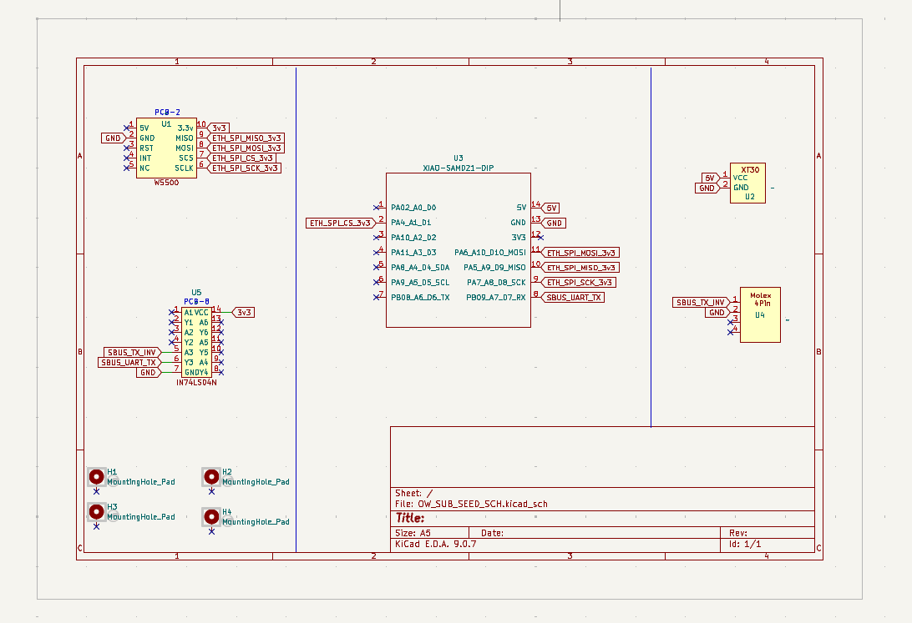
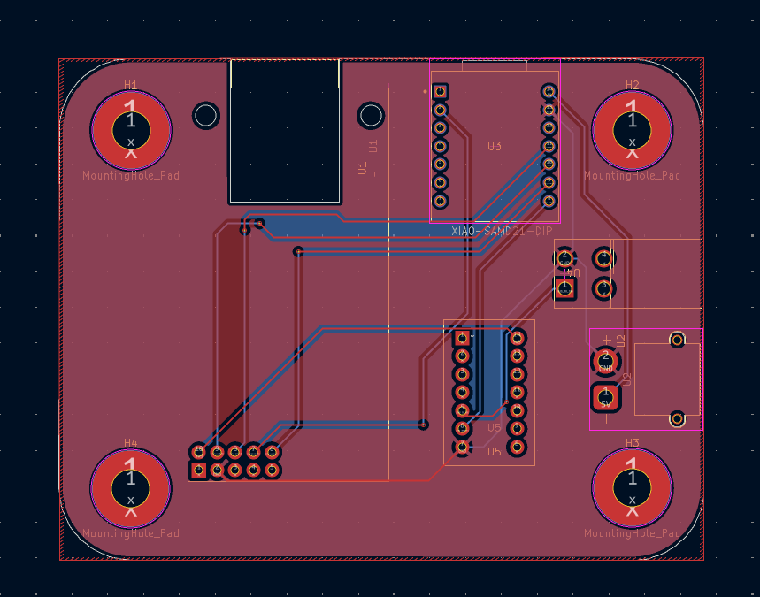
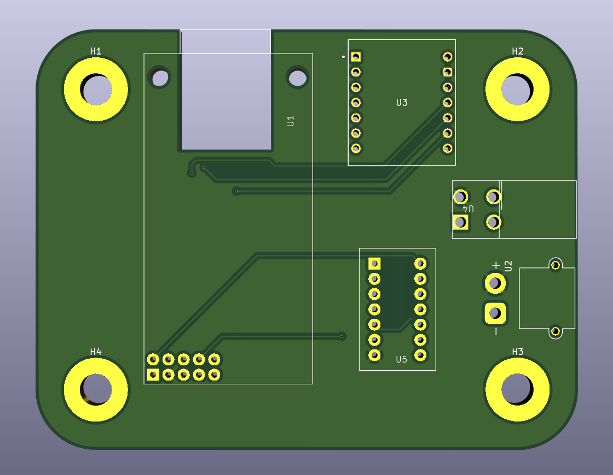
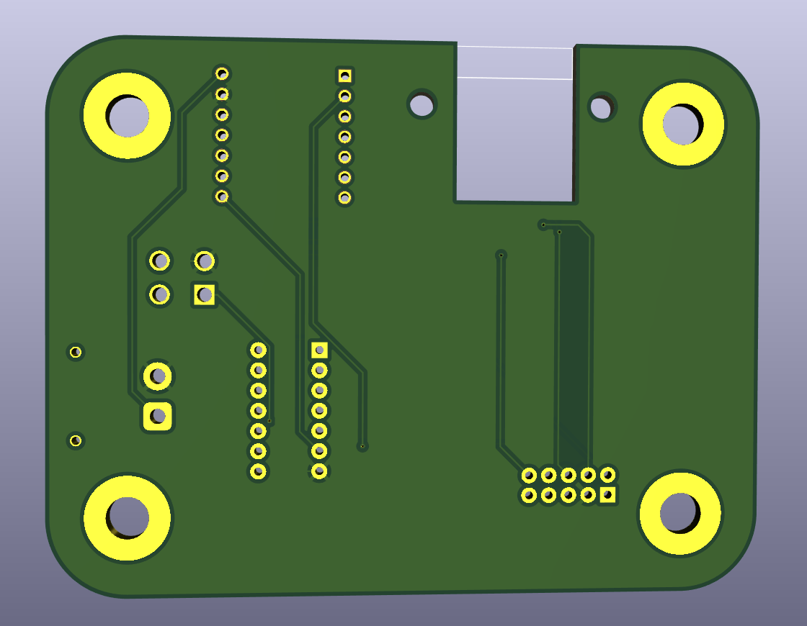

# 🤖 Autonomous Vehicle — Sub Control Board (OW_Sub_Seed_PCB)

> **Designed by:** Janardhan BV  
> **Tool:** KiCad EDA 9.0.7  
> **File:** `OW_SUB_SEED_SCH.kicad_sch`  
> **MCU:** Seeed XIAO SAMD21 (ARM Cortex-M0+, 48 MHz)  
> **Type:** Sub PCB — Ethernet + SBUS Gateway Board  
> **Parent Project:** Autonomous Wheeled Vehicle (OW_Main_PCB)

---

## 📌 Project Overview

This is the **Sub Control Board** of the Autonomous Wheeled Vehicle project, designed to act as a dedicated **Ethernet ↔ SBUS communication gateway**. A full STM32 Nucleo F446RE, this sub PCB uses the compact **Seeed XIAO SAMD21** (ARM Cortex-M0+) to handle a focused task: receiving commands over **W5500 Ethernet (TCP/IP)** and forwarding them as an **inverted SBUS UART signal** (via 74LS04N hex inverter) to RC/motor control receivers.

The board features:
- **Seeed XIAO SAMD21** as the lightweight edge MCU
- **W5500** hardwired TCP/IP Ethernet controller (SPI 3.3V)
- **74LS04N Hex Inverter** for SBUS signal logic inversion
- **XT30 connector** for 5V input power
- **Molex 4-pin output** for SBUS signal to downstream devices
- Compact square form factor with **4× corner mounting holes**

---

## 🖼️ Project Visuals

### Schematic


### PCB Layout


### 3D Board Top View


### 3D Board Bottom View



---

## 🏗️ System Architecture

```
5V Input (XT30 — U2)
      │
      ├──► XIAO SAMD21 (U3) ◄──── USB-C (onboard programming)
      │          │
      │     SPI (3.3V)
      │          │
      └──► W5500 Ethernet (U1)
                 │
          TCP/IP Network ──► Command packets from Main Board / PC
                 │
          XIAO SAMD21 decodes command
                 │
          UART TX (SBUS data — inverted logic required)
                 │
          74LS04N (U5) — Signal Inversion
                 │
          SBUS_UART_TX ──► Molex 4-pin (U4) ──► RC/Motor Receiver
```

---

## 📊 Component BOM

| Ref | Component | Part | Function |
|:---:|:---|:---|:---|
| U3 | MCU | Seeed XIAO SAMD21 (DIP footprint) | Main microcontroller (Cortex-M0+, 48 MHz) |
| U1 | Ethernet Controller | W5500 (PCB-2 module) | SPI hardwired TCP/IP Ethernet |
| U5 | Hex Inverter | 74LS04N (DIP-14) | SBUS UART signal logic inversion |
| U2 | Power Connector | XT30 | 5V input power |
| U4 | Output Connector | Molex 4-pin | SBUS output + GND |
| H1–H4 | Mounting Holes | MountingHole_Pad | 4× PCB corner mounting |

---

## 🔌 Pin Assignment — XIAO SAMD21 (U3)

| XIAO Pin | Signal Name | Function |
|:---:|:---|:---|
| PA02 / A0 / D0 | GPIO | General purpose I/O |
| PA4 / A1 / D1 | GPIO | General purpose I/O |
| PA10 / A2 / D2 | GPIO | General purpose I/O |
| PA11 / A3 / D3 | GPIO | General purpose I/O |
| PA8 / A4 / D4 / SDA | I2C SDA | I2C data |
| PA9 / A5 / D5 / SCL | I2C SCL | I2C clock |
| PB08 / A6 / D6 / TX | UART TX | SBUS UART transmit → 74LS04N |
| PA6 / A1D / D10 / MOSI | SPI MOSI | W5500 SPI MOSI |
| PA5 / A9 / D9 / MISO | SPI MISO | W5500 SPI MISO |
| PA7 / A8 / D8 / SCK | SPI SCK | W5500 SPI clock |
| PB09 / A7 / D7 / RX | UART RX | UART receive |
| 5V | Power | 5V input from XT30 |
| 3V3 | Power | 3.3V output to W5500 |
| GND | Ground | Common ground |

---

## 🌐 W5500 Ethernet Controller (U1)

| W5500 Pin | Connected Net | XIAO Pin |
|:---:|:---|:---:|
| MISO | ETH_SPI_MISO_3v3 | PA5 / D9 |
| MOSI | ETH_SPI_MOSI_3v3 | PA6 / D10 |
| SCS | ETH_SPI_CS_3v3 | PA11 / D3 |
| SCLK | ETH_SPI_SCK_3v3 | PA7 / D8 |
| RST | ETH Reset | GPIO |
| INT | ETH Interrupt | GPIO |
| VCC | 5V | XT30 |
| 3.3V | 3v3 | XIAO 3V3 |

The W5500 provides a **full hardwired TCP/IP stack** (TCP, UDP, IPv4, ARP, ICMP) over SPI, supporting up to **8 simultaneous sockets** with 32KB internal buffer — enabling this sub-board to receive control commands from the main vehicle computer or a remote PC over Ethernet.

---

## 📡 SBUS Signal — 74LS04N Inverter (U5)

**SBUS** (Serial Bus) is a digital RC protocol used by Futaba and FrSky receivers. It uses **inverted UART** at 100,000 baud (100kbps), 8E2 format. Since the XIAO SAMD21 outputs standard logic-level UART (non-inverted), the **74LS04N hex inverter** flips the signal:

```
XIAO UART TX (D6/PB08)
      │
      └──► 74LS04N Input (A1) ──► Output (Y1) ──► SBUS_UART_TX
                 (Logic Inversion: HIGH→LOW, LOW→HIGH)
                      │
               SBUS_TX_INV net → Molex 4-pin (U4)
```

**SBUS Protocol Parameters:**
- Baud rate: 100,000 bps
- Format: 8 bits, Even parity, 2 stop bits (8E2)
- Logic: Inverted (idle = LOW, start bit = HIGH)
- Frame: 25 bytes, 16 channels, 2 flags

---

## 🔋 Power Architecture

```
XT30 (U2) — 5V Input
   ├──► XIAO SAMD21 VCC (5V pin)
   │         └──► XIAO internal 3.3V LDO ──► 3v3 net
   └──► W5500 VCC (5V)
              └──► W5500 internal 3.3V reg ──► W5500 core
```

---

## 📐 PCB Design Highlights

- **EDA Tool:** KiCad EDA 9.0.7
- **File:** `OW_SUB_SEED_SCH.kicad_sch`
- **Board Shape:** Compact square with rounded corners
- **Mounting:** 4× corner mounting holes (H1–H4) for chassis mount
- **XIAO SAMD21 (U3):** Piggyback mount on dual-row female header footprint
- **W5500 (U1):** Module footprint top-left, close to XIAO SPI pins
- **74LS04N (U5):** DIP-14 IC socket, centrally placed for easy replacement
- **XT30 (U2):** Right-side edge for easy cable routing
- **Molex 4-pin (U4):** Right-side, close to SBUS output target

---

## 🔗 Relationship to Main Control Board

| Feature | Main Board (OW_Main_PCB) | Sub Board (OW_Sub_Seed_PCB) |
|:---|:---:|:---:|
| MCU | STM32 Nucleo F446RE (180 MHz) | Seeed XIAO SAMD21 (48 MHz) |
| Ethernet | W5500 (SPI) | W5500 (SPI) |
| RS-485 | MAX485 | ✗ |
| SBUS Output | ✗ | 74LS04N + UART |
| Relays | 2× G5LE-1 | ✗ |
| PWM Ports | 4× | ✗ |
| Power Input | 12V (XT30) | 5V (XT30) |
| Board Size | Large (chassis mount) | Small (compact sub-board) |
| KiCad File | `Ow_main_pcb.kicad_sch` | `OW_SUB_SEED_SCH.kicad_sch` |

---

## 🧪 Bring-Up & Testing

### Step 1 — Power Check
- Apply 5V via XT30 (U2)
- Measure 3.3V at W5500 VCC and XIAO 3V3 pin
- Idle current: ~80–120 mA (XIAO + W5500)

### Step 2 — XIAO SAMD21 Programming
- Connect USB-C cable to XIAO SAMD21
- Board appears as **COM port / /dev/ttyACM0**
- Upload sketch via Arduino IDE (select **Seeed XIAO SAMD21**)

### Step 3 — Ethernet Test
- Connect RJ45 to W5500 module
- Ping board IP from PC
- Send UDP/TCP test packet and verify receipt by XIAO

### Step 4 — SBUS Inversion Test
- Program XIAO to output SBUS frame at 100kbps 8E2
- Probe XIAO TX (D6) — should show **normal UART** (idle HIGH)
- Probe 74LS04N output (SBUS_UART_TX) — should show **inverted UART** (idle LOW)
- Connect to RC receiver — verify 16 SBUS channels decoded correctly

---

## 🖥️ Firmware (Arduino / XIAO SAMD21)

```cpp
// Required Libraries
#include <SPI.h>              // W5500 SPI
#include <Ethernet.h>         // WIZnet W5500 Ethernet library
// or use: Ethernet2.h / WIZ5500 HAL

// SBUS output via Serial1 (PB08 = D6)
// 100000 baud, 8E2, inverted by 74LS04N hardware

void setup() {
  Serial1.begin(100000, SERIAL_8E2);  // SBUS baud
  Ethernet.begin(mac, ip);            // W5500 init
}

void loop() {
  // Receive commands over Ethernet
  // Parse → encode SBUS frame
  // Transmit via Serial1 → 74LS04N → SBUS output
}
```

---

## 📁 Repository Structure

```
AV-Sub-Seed-PCB/
├── images/
│   ├── SCH.jpg               ← KiCad schematic export
│   └── TopView.jpg           ← 3D board render
├── KiCad/
│   ├── OW_SUB_SEED_SCH.kicad_sch   ← Schematic source
│   ├── OW_SUB_SEED.kicad_pcb       ← PCB layout source
│   └── OW_SUB_SEED.kicad_pro       ← Project file
├── Gerber/
│   └── (Gerber + drill files)
├── Firmware/
│   └── ow_sub_seed_fw/
│       └── ow_sub_seed_fw.ino
└── README.md
```

---

## 🏷️ GitHub Topics to Add

```
autonomous-vehicle  xiao-samd21  seeed  w5500  ethernet
sbus  rc-protocol  74ls04n  signal-inversion  kicad
pcb-design  embedded-systems  robotics  cortex-m0
```

---

## ⚠️ Design Notes & Cautions

- **74LS04N supply is 5V** — ensure VCC of 74LS04N is connected to 5V, not 3.3V, for proper TTL output swing
- **SBUS baud rate is exactly 100,000 bps** — XIAO SAMD21 `Serial1.begin(100000, SERIAL_8E2)` must be used; standard 115200 will not work
- **W5500 is 3.3V logic** — XIAO SAMD21 is 3.3V native, no level shifting needed on SPI lines
- **XT30 is 5V input** — do not apply 12V; this sub-board is 5V-only unlike the main board which is 12V
- **74LS04N DIP-14** — socketed for easy replacement; verify pin 7 (GND) and pin 14 (VCC) before powering

---

## 📄 License

This project is open for educational and personal use.  
© 2025 Janardhan BV — All rights reserved.

---

## 🙋 Author

**Janardhan BV**  
Embedded Hardware Engineer | PCB Design | Power Electronics  
📍 Bengaluru, India

---
*Designed in KiCad EDA 9.0.7 | XIAO SAMD21 Ethernet-to-SBUS Sub PCB — Autonomous Vehicle*
